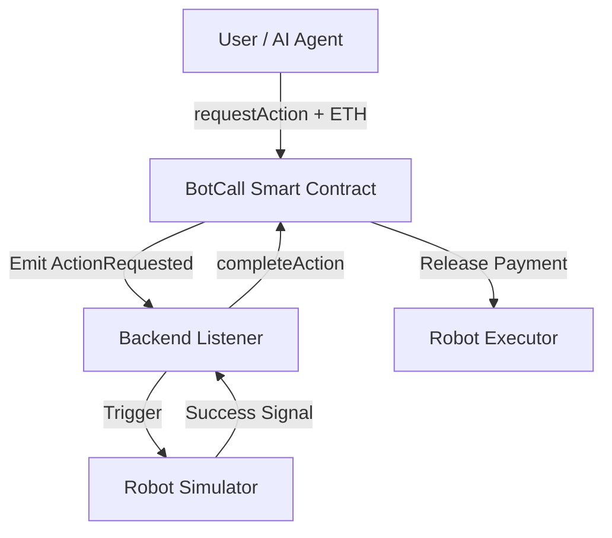

# BOT-CALL Protocol


BOT-CALL is an open protocol that enables AI agents and robots to receive blockchain payments for performing real-world actions. Built for the emerging agentic economy where autonomous systems can participate in decentralized labor markets.

## 🚀 Architecture



## 📂 Project Structure

- `contracts/`: Solidity smart contracts for the protocol.
- `backend/`: Node.js event listener and robot simulator.
- `frontend/`: React-based user interface for interacting with robots.
- `scripts/`: Deployment and management scripts.
- `test/`: Hardhat test suite.

## 🛠 Tech Stack

- **Blockchain**: Base (Ethereum L2)
- **Smart Contract**: Solidity, Hardhat
- **Backend**: Node.js, Ethers.js
- **Frontend**: React, VITE, Ethers.js

## ⚙️ Installation

1. **Clone the repository**
   ```bash
   git clone https://github.com/nayrbryanGaming/botcall-protocol.git
   cd botcall-protocol
   ```

2. **Install Root Dependencies**
   ```bash
   npm install
   ```

3. **Install Frontend Dependencies**
   ```bash
   cd frontend && npm install && cd ..
   ```

4. **Configuration**
   Create a `.env` file in the root based on `.env.example`:
   ```
   PRIVATE_KEY=your_wallet_private_key
   BASE_SEPOLIA_RPC_URL=https://sepolia.base.org
   CONTRACT_ADDRESS=
   ```

## 🚀 Deployment

1. **Compile Contracts**
   ```bash
   npx hardhat compile
   ```

2. **Deploy to Base Sepolia**
   ```bash
   npx hardhat run scripts/deploy.js --network base-sepolia
   ```
   Copy the deployed address and update `backend/listener.js` or `.env`.

## 🤖 Running the System

1. **Start the Backend Listener**
   ```bash
   npm run backend
   ```

2. **Start the Frontend**
   ```bash
   cd frontend
   npm run dev
   ```

## 🛣 Future Roadmap

- **Task Verification Oracles**: Decentralized proof-of-work for physical actions.
- **Robot Marketplace**: Discover and compare robot capabilities and pricing.
- **AI Agent Integration**: Autonomous hiring of robots via LangChain or AutoGPT.
- **Reputation System**: On-chain rating system for robot performance.
- **Hardware APIs**: Integration with ROS (Robot Operating System).

## 📄 License
This project is licensed under the MIT License.
