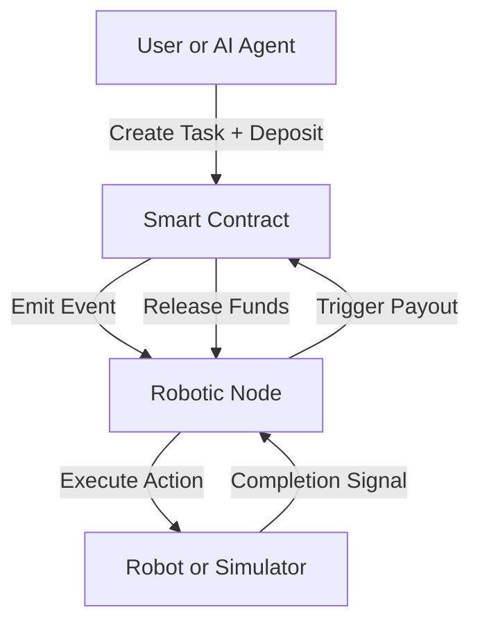

# BOT-CALL Protocol
## The Economic Layer for Robots

[](https://github.com/nayrbryangaming/botcall-protocol/actions/workflows/test.yml)
-16a34a)


> BOT-CALL is a decentralized protocol enabling robots and AI agents to accept tasks, execute actions, and receive on-chain payments through a pay-per-action model.

## Live Links

- Demo: https://botcall-protocol.vercel.app
- Repository: https://github.com/nayrbryangaming/botcall-protocol
- Contract (Base Sepolia): https://sepolia.basescan.org/address/0x408B7c870Ce7bd5Db3FBF92eDAA99C7b5e7AdDD1

## Problem

Robots can execute tasks, but they cannot yet participate in open economic systems.

There is no standard trustless flow to:

- Accept decentralized jobs
- Verify completion
- Receive automatic payment

## Solution

BOT-CALL introduces a pay-per-action economic interface for robotics:

- On-chain task requests
- Autonomous execution
- Automatic payment settlement

## System Flow



## Architecture

1. Smart Contract (On-chain): task creation, escrow payment, and reward release.
2. Robotics Node (Off-chain): listens to blockchain events, executes commands, and triggers completion.
3. AI Layer: natural language to action mapping.
4. Frontend: dashboard UI and wallet interaction.

## Tech Stack

| Layer | Tech |
| --- | --- |
| Blockchain | Base Sepolia |
| Smart Contract | Solidity + Hardhat |
| Backend | Node.js + Ethers.js |
| Frontend | React + Vite |
| AI | Groq (Llama 3) |
| Deployment | Vercel |

## Quick Start (2 Minutes)

```bash
git clone https://github.com/nayrbryangaming/botcall-protocol.git
cd botcall-protocol
npm install
```

Create `.env` in project root:

```env
PRIVATE_KEY=your_private_key
BASE_SEPOLIA_RPC_URL=https://sepolia.base.org
CONTRACT_ADDRESS=your_contract_address
GROQ_API_KEY=your_groq_api_key
VITE_CONTRACT_ADDRESS=your_contract_address
VITE_RPC_URL=https://sepolia.base.org
```

Optional: deploy your contract

```bash
npm run deploy:base-sepolia
```

Run the system in two terminals:

```bash
# Terminal 1
npm run backend
```

```bash
# Terminal 2
cd frontend
npm run dev
```

## Testing (No Robot Needed)

Simulator mode is built in. The backend executes actions and prints robot telemetry in the console.

Typical flow:

1. Connect wallet
2. Create task
3. Confirm transaction
4. Backend executes action
5. Payment is released on-chain

## Current Status

Stage: MVP (Testnet)

- Tasks executed: 7+
- Network: Base Sepolia
- Commands tested: SCAN, MOVE, DOCK, MAP, STOP, INSPECT, PICK

Validated end-to-end path:

`request -> execution -> payment`

## AI Integration

Example:

`"Scan the room" -> SCAN`

## Roadmap

Phase 1 - MVP

- Smart contract
- Simulator
- Dashboard

Phase 2 - Robotics

- ROS integration
- Real robot execution

Phase 3 - Verification

- Proof-of-action
- Oracle layer

Phase 4 - Marketplace

- Robot service marketplace
- Reputation system

## Business Model

- 1-2% fee per task
- Robotics marketplace
- API access

## Security

- Non-reentrant contracts
- Controlled payout logic
- Event-driven execution

## Vision

Robots will not only execute tasks.

They will participate in the economy.

BOT-CALL is building the economic layer for machines.

## Contributing

Contributors welcome:

- Robotics engineers
- AI developers
- Web3 builders

## License

MIT

## Author

Bryan (nayrbryanGaming)

- X: https://x.com/nayrbryangaming
- GitHub: https://github.com/nayrbryangaming

## Final Note

This project demonstrates a working connection between blockchain, AI, and robotic execution.

Built for the Agentic Economy.
