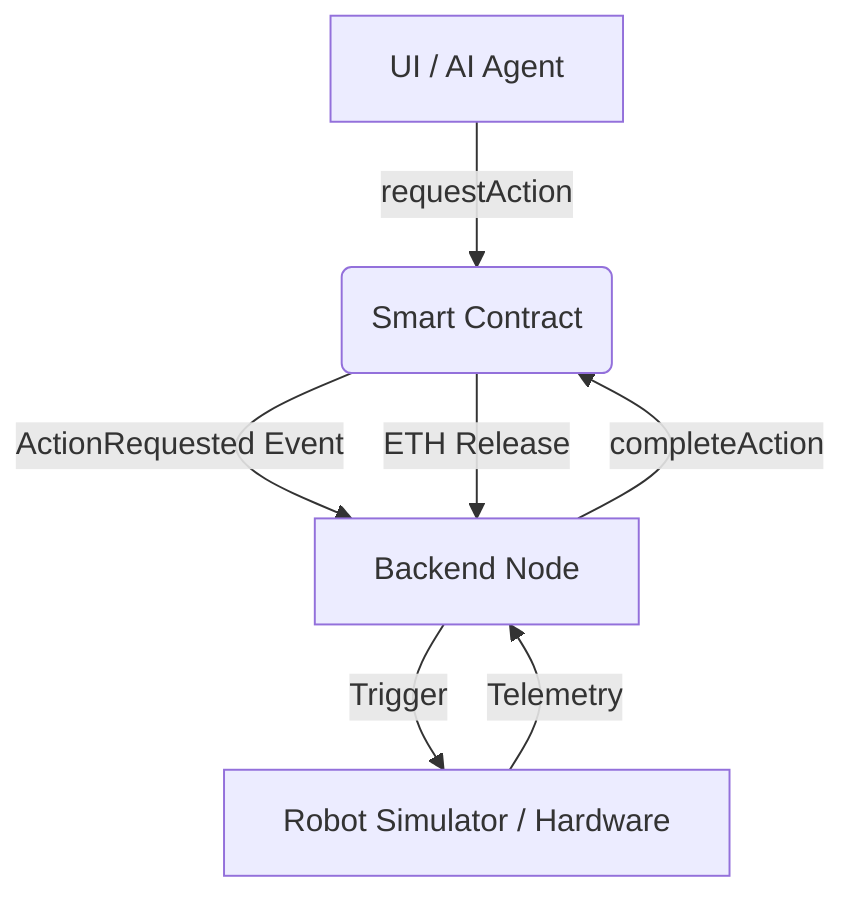

# BOT-CALL Protocol 🤖
> Decentralized Pay-Per-Action Robotics on Base.

BOT-CALL is a protocol that enables on-chain coordination between humans, AI agents, and autonomous robotic units. It provides a secure, trustless primitives for "renting" robotic time for specific tasks using the Base blockchain.

---

## 🚀 System Architecture



## 🛠️ Tech Stack
- **Blockchain**: Base (Ethereum L2)
- **Smart Contracts**: Solidity (Hardhat)
- **Backend / Oracles**: Node.js (Ethers.js v6)
- **Intelligence**: Groq Llama-3 (Cloud Inference)
- **Frontend**: React (Vite, Glassmorphism UI)

---

## 📡 Protocol Workflow (MVP)

1. **Mission Request**: User sends ETH as a reward to the `BotCall` contract via `requestAction(string action)`.
2. **Event Polling**: The Backend Node scans the blockchain for `ActionRequested` events.
3. **Reasoning**: The AI Strategist (Groq-Llama3) verifies the action and formulates an execution bridge.
4. **Execution**: The Robotic Unit executes the action (Simulation logic) and generates telemetry.
5. **Settlement**: The Node calls `completeAction(taskId)` with proof of work, triggering the contract to release the ETH reward to the robot.

---

## 💻 Installation & Setup

### 1. Requirements
- Node.js (v18+)
- MetaMask (Base Sepolia Testnet)
- Groq API Key

### 2. Environment Configuration
Create a `.env` in the root:
```env
PRIVATE_KEY=your_robot_wallet_pk
BASE_SEPOLIA_RPC_URL=https://sepolia.base.org
CONTRACT_ADDRESS=0x8A67A55B496A4291F0F201efC221E260d84b1e41
GROQ_API_KEY=your_groq_key
```

### 3. Deploy & Run
```bash
# Install dependencies
npm install

# Start Backend Node
npm run backend

# Start Frontend
cd frontend
npm install
npm run dev
```

---

## ✅ Performance & Security v1.4.2
- **Nonce Shield**: Robust nonce management ensures zero transaction collisions.
- **Polling 2.0**: Advanced block-range polling logic for zero missed events.
- **EVM Compatibility**: Compiled for `paris` EVM to maximize stability on Base.
- **Design**: Premium glassmorphism UI with natural language AI interface.

---

## 🗺️ Roadmap
- [ ] Multi-Robot Fleet Management
- [ ] ZK-Proofs for Hardware Execution 
- [ ] Robot Reputation & Staking (Slashing for failures)
- [ ] Hardware API Bridge (ROS2 Integration)

---
**Created by nayrbryanGaming for the Base Robotics Hackathon.**
"The bridge between Silicon and Reality."
