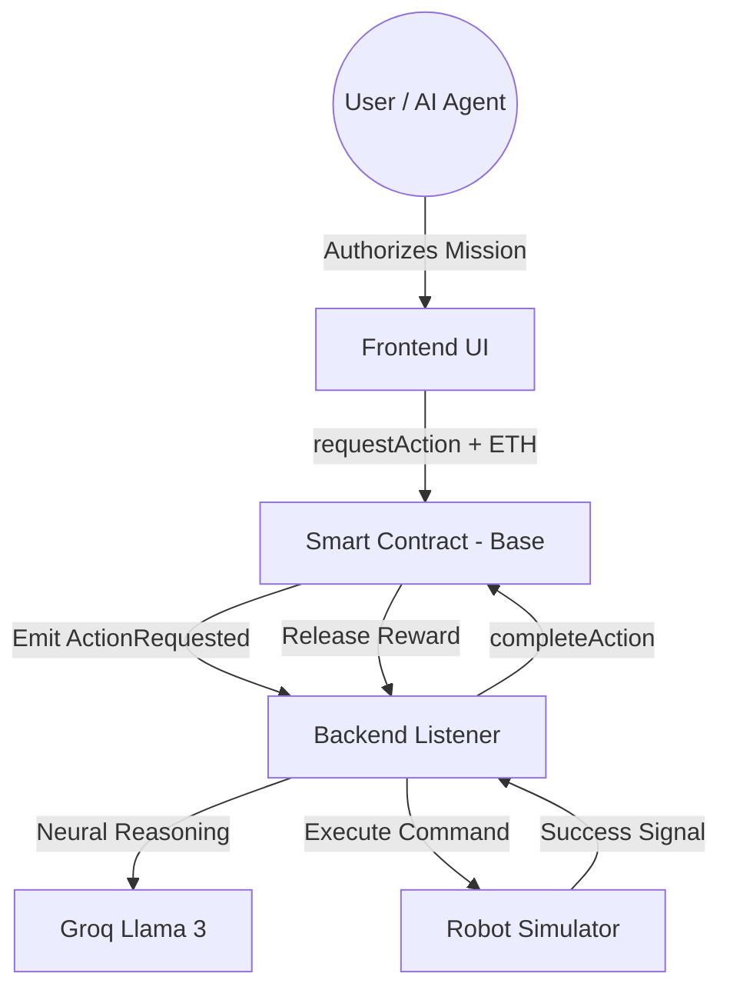

# 🤖 BOT-CALL PROTOCOL
### Decentralized Agentic Robotics & Economic Coordination Layer

**BOT-CALL** is a futuristic protocol that bridges the gap between AI agents and real-world robotic execution. It provides an on-chain Primitive for "Pay-per-action" robotics, allowing any wallet or autonomous agent to hire a robotic unit for physical tasks on the Base network.

---

## 🌌 System Architecture



## 🛠️ Tech Stack
- **Blockchain**: Base Sepolia (L2)
- **Framework**: React + Vite
- **Smart Contracts**: Solidity + Hardhat + OpenZeppelin
- **Backend**: Node.js + Ethers.js v6
- **AI Brain**: Groq SDK (Llama 3 70B)
- **Deployment**: Vercel (Frontend) + GitHub Actions (CI/CD)

---

## 🚀 Installation & Setup

### 1. Prerequisites
- Node.js v18+
- MetaMask Wallet
- Groq API Key
- Base Sepolia Testnet ETH

### 2. Environment Configuration
Create a `.env` file in the root directory:
```env
PRIVATE_KEY=your_private_key
BASE_SEPOLIA_RPC_URL=https://sepolia.base.org
CONTRACT_ADDRESS=your_deployed_contract_address
GROQ_API_KEY=your_groq_api_key

VITE_CONTRACT_ADDRESS=your_deployed_contract_address
VITE_GROQ_API_KEY=your_groq_api_key
VITE_RPC_URL=https://sepolia.base.org
```

### 3. Deployment
```bash
# Install dependencies
npm install

# Deploy Smart Contract
npm run deploy:base-sepolia

# Start Backend Robotic Node
npm run backend

# Start Frontend Terminal
cd frontend && npm run dev
```

---

## 🦾 Workflow Guide
1. **Connect Terminal**: Enter the dashboard and sync your MetaMask wallet to the Base Sepolia network.
2. **AI Command**: Use the "AI Brain Interface" to send natural language requests like *"Go check the perimeter"* or *"Scan for objects"*.
3. **Reasoning**: The Llama 3 brain will interpret your intent, decide on the best physical action, and propose a mission.
4. **Authorize**: Confirm the transaction. Your ETH reward is locked in the contract.
5. **Execution**: The backend listener detects the request, triggers the simulator, and provides a real-time status feed.
6. **Finalization**: Once complete, the payment is released to the robotic node automatically.

---

## 🗺️ Roadmap
- [ ] **Phase 2**: Integration with physical ROS (Robot Operating System) nodes.
- [ ] **Phase 3**: Task Verification Oracles (using DePIN nodes for proof-of-work).
- [ ] **Phase 4**: Robot Marketplace & Reputation System.
- [ ] **Phase 5**: Multi-chain support for cross-border robotic economy.

---

## 🛡️ Security
- Non-reentrant reward release.
- Ownership-protected administrative functions.
- Resilient backend polling with recovery mechanisms.

---
**Developed for the Future of Agentic Robotics.**  
*© 2026 BOT-CALL Protocol*
