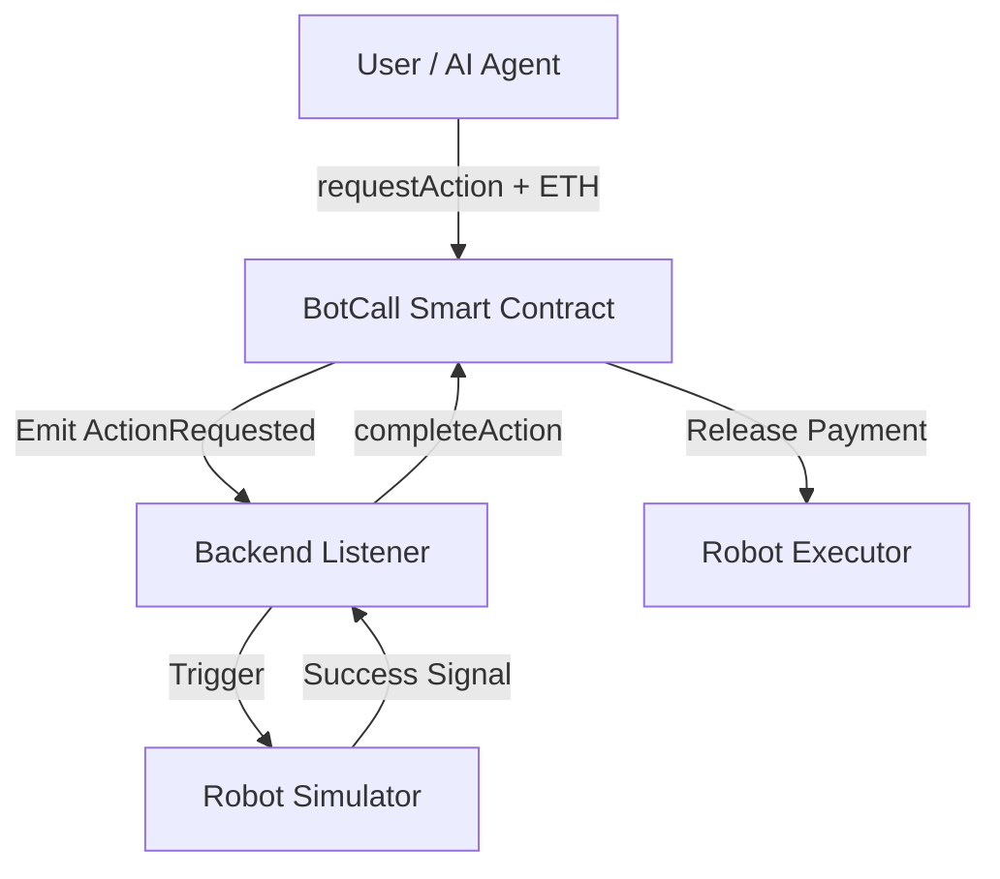

# BOT-CALL Protocol 🤖💰


BOT-CALL is an open protocol that enables AI agents and robots to receive blockchain payments for performing real-world actions. Built for the emerging **Agentic Robotics Economy**.

## 🚀 Architecture Overview

The system follows a 4-tier architecture designed for low latency and high reliability:

1.  **Frontend (Vercel)**: High-performance React UI for user/agent interaction.
2.  **Smart Contract (Base L2)**: Secure, gas-efficient escrow and payment logic.
3.  **Backend Listener (Node.js)**: Off-chain event monitor connecting blockchain to hardware.
4.  **Robot Simulator**: A script-based execution environment simulating physical kinetics.



## 🤖 Robot Simulator

Since physical hardware is optional for this MVP, we use a **Robot Simulator Script** (`backend/robotSimulator.js`) to demonstrate the feedback loop.

- **Actions supported**: `WAVE`, `SCAN ROOM`.
- **Logic**: Simulates actuator initialization, kinetic movement delays, and sensor success signals.

## 💻 Tech Stack

- **Blockchain**: Base (Ethereum L2)
- **Smart Contract**: Solidity, Hardhat
- **Backend**: Node.js, Ethers.js
- **Frontend**: React, VITE, Ethers.js, Vercel

## ⚙️ Installation & Setup

1.  **Clone the repository**
    ```bash
    git clone https://github.com/nayrbryanGaming/botcall-protocol.git
    cd botcall-protocol
    ```

2.  **Install Dependencies**
    ```bash
    npm install
    cd frontend && npm install && cd ..
    ```

3.  **Environment Variables**
    Create a `.env` file in the root:
    ```env
    PRIVATE_KEY=your_private_key
    BASE_SEPOLIA_RPC_URL=https://sepolia.base.org
    CONTRACT_ADDRESS=0x3dB23698E922432730D7169CF79b85EA51416e49
    ```

## 🧪 Testing End-to-End

Follow these steps for a full demo:

1.  **Run Backend Listener** (Local Machine):
    ```bash
    npm run backend
    ```
    *Listener will wait for ActionRequested events.*

2.  **Access Frontend**:
    Open the Vercel URL or run locally:
    ```bash
    cd frontend && npm run dev
    ```

3.  **Execute Action**:
    - Connect MetaMask (Base Sepolia).
    - Click **"Hire Robot to Wave"**.
    - Watch the **Backend Console**: monitor "Robot waving 👋" and "Payment released".

## ☁️ Vercel Deployment

The frontend is optimized for Vercel:
- **Project URL**: `botcall.vercel.app`
- **Root Directory**: `frontend`
- **Build Command**: `npm run build`
- **Output Directory**: `dist`

## 🛣 Future Roadmap

- **AI Agent Integration**: Autonomous task planning using LLMs (e.g., Groq Llama 3).
- **Task Verification Oracles**: Decentralized proof of physical work.
- **Robot Marketplace**: Discover and compare robot capabilities.
- **Hardware APIs**: Integration with ROS (Robot Operating System).

## 📄 License
This project is licensed under the MIT License.

