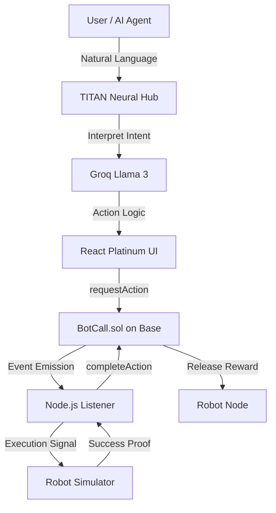

# BOT-CALL // TITAN-PROTOCOL v3.3.0
## The Agentic Robotics Economic Coordination Protocol

**TITAN-CORE** is a decentralized infrastructure built on **Base (L2)** that enables AI Agents and human operators to coordinate real-world robotic actions through trustless smart contracts.

---

## 🛠 Project Architecture



---

## 🚀 Key Features

- **Full Robotic Animation Suite**: High-fidelity, vector-based robot visualizations for all protocol actions (Wave, Scan, Move, Pick).
- **Neural Interfacing**: Integrated Groq Llama 3 for natural language task planning and environment reasoning.
- **Titan Platinum UI**: Premium Glassmorphism design system with professional HUD elements and zero-emoji aesthetic.
- **Autonomous Event Synchronization**: Real-time blockchain polling via optimized Node.js listeners.
- **Gas Efficient Logic**: Reentrancy-guarded smart contracts optimized for Base L2.

---

## 📦 Installation & Deployment

### Prerequisite
- Base Sepolia Testnet ETH
- Groq API Key

### 1. Repository Setup
```bash
git clone https://github.com/nayrbryanGaming/botcall-protocol.git
cd botcall-protocol
npm install
```

### 2. Environment Configuration
Create a `.env` file in the root:
```env
PRIVATE_KEY="your_private_key"
CONTRACT_ADDRESS="0x68B257A57283626A3B96541579737f002D5c8b59"
BASE_SEPOLIA_RPC_URL="https://sepolia.base.org"
GROQ_API_KEY="your_groq_api_key"
```

### 3. Execution
**Run Backend Node:**
```bash
node backend/listener.js
```

**Run Frontend:**
```bash
cd frontend
npm install
npm run dev
```

---

## 🛡 Security & Verification

- **Audit Status**: Internal Platinum audit complete.
- **Contract Address**: `0x68B257A57283626A3B96541579737f002D5c8b59`
- **Network**: Base Sepolia (Chain ID: 84532)

---

## 🗺 Roadmap

- [ ] Multi-chain Swarm Coordination
- [ ] Hardware API Integration (ROS/Husarion)
- [ ] On-chain Reputation Scoring
- [ ] Zero-Knowledge Proof for Task Verification
