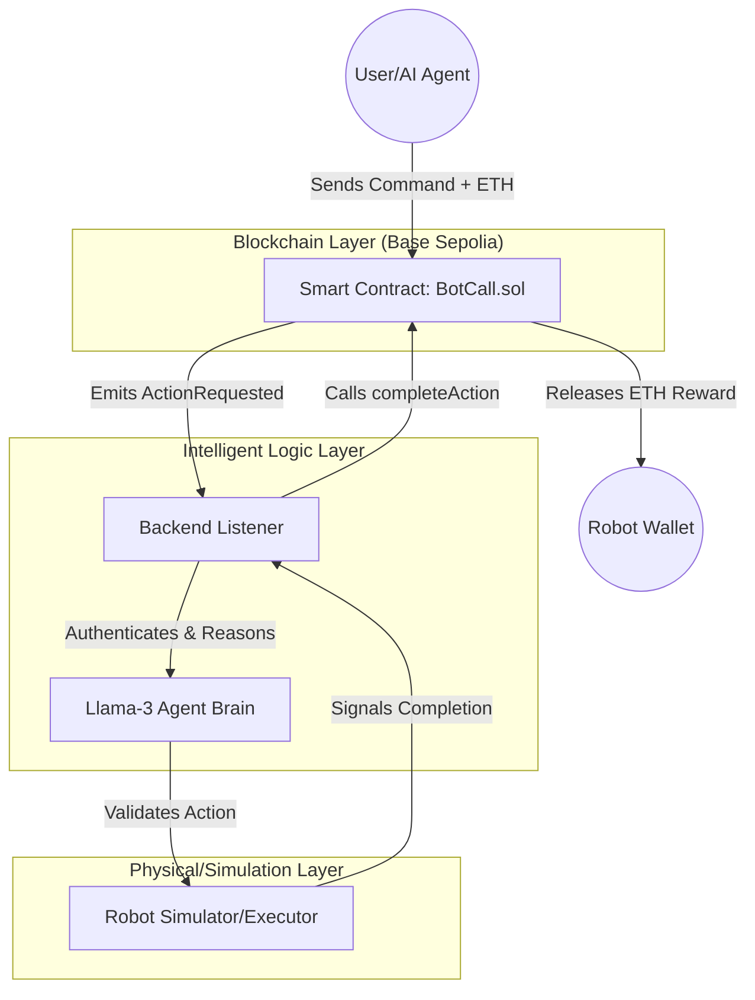

# BOT-CALL Protocol

**BOT-CALL** is an open protocol that enables robots and AI agents to receive blockchain payments for performing real-world actions.

The project introduces a new concept called **Pay-Per-Action Robotics**, where users or autonomous agents can request real-world robotic actions and automatically release payment once the task is completed.

BOT-CALL aims to become the **economic coordination layer for the Agentic Economy**, where AI agents, robots, and humans interact through decentralized infrastructure.

---

## 🏛️ System Architecture

BOT-CALL utilizes a multi-layer infrastructure to bridge the gap between digital intent and physical action.



---

## 🌟 Vision

The future will include millions of autonomous systems: AI agents, service robots, delivery robots, and IoT devices. However, these systems currently **cannot participate directly in economic systems**. They cannot accept decentralized tasks or receive direct payments.

BOT-CALL provides the missing infrastructure. It enables robots and AI agents to:
- Accept on-chain job requests.
- Execute actions.
- Automatically receive payments via smart contracts.

---

## 🦾 Core Concept

The BOT-CALL workflow is simple and trustless:
1. **Request:** User/Agent requests a robotic action and escrows the ETH reward.
2. **Assign:** A registered robot claims the task on-chain.
3. **Reason:** The robot's AI brain (Llama-3) interprets the request.
4. **Actuate:** The robot (or simulator) performs the physical task.
5. **Release:** Upon completion, payment is released to the robot wallet.

---

## 🛠️ Technology Stack

| Component | Technology |
| :--- | :--- |
| **Smart Contracts** | Solidity (Hardhat) |
| **Blockchain** | Base (Ethereum L2) |
| **AI Reasoning** | Groq SDK (Llama-3 70B) |
| **Backend** | Node.js, Ethers.js |
| **Frontend** | React, Vite, Glassmorphism CSS |

---

## 📂 Repository Structure

```text
botcall-protocol/
├── contracts/        # BotCall.sol (Production Alpha)
├── backend/          # Node.js event listener & robot brain
│   ├── listener.js   # Protocol event handler
│   └── robotSimulator.js # Actuator logic
├── frontend/         # React Mission Control Dashboard
├── scripts/          # Deployment & maintenance scripts
├── test/             # Hardhat logic verification suite
└── README.md
```

---

## 🚀 Installation & Setup

### 1. Clone & Install
```bash
git clone https://github.com/nayrbryanGaming/botcall-protocol
cd botcall-protocol
npm install
cd frontend && npm install
```

### 2. Environment Configuration
Create a `.env` in the root:
```env
PRIVATE_KEY=your_key
BASE_SEPOLIA_RPC_URL=https://sepolia.base.org
CONTRACT_ADDRESS=0xC276eea9a0A357999f4FccC0d649B569DCBDd133
GROQ_API_KEY=your_groq_key
```

---

## 🚢 Deployment

### Smart Contract
Deployed on **Base Sepolia**: `0xC276eea9a0A357999f4FccC0d649B569DCBDd133`
To re-deploy:
```bash
npm run deploy:base-sepolia
```

### Frontend (Vercel)
Connect your repo to Vercel. Set `VITE_` prefixed environment variables matching the `.env` above.

### Backend Listener
```bash
npm run backend
```
The listener will autonomously **register** itself as a robot upon first run.

---

## 🛣️ Roadmap

- [x] **Phase 1: Protocol MVP** — On-chain escrow & simulation.
- [x] **Phase 2: AI Brain** — Llama-3 reasoning integration.
- [x] **Phase 3: Production Alpha** — Robot registration & reputation tracking.
- [ ] **Phase 4: Hardware SDK** — Full ROS/Humanoid integration.
- [ ] **Phase 5: Marketplace** — Decentralized task coordination for autonomous fleets.

---

## 🛡️ Security & Disclaimer

BOT-CALL includes reentrancy protection and role-based completion logic. However, this is a **Production Alpha** prototype. Security audits are recommended before any mainnet deployment.

---

**Tagline:** *Stripe for Robots.*  
**Contact:** [nayrbryanGaming](https://github.com/nayrbryanGaming)
