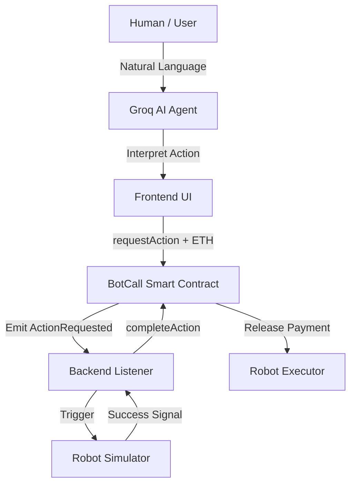

# BOT-CALL Protocol 🤖💰


BOT-CALL is an open protocol that enables AI agents and robots to receive blockchain payments for performing real-world actions. This MVP demonstrates the **Agentic Robotics Economy**—where AI reasons and blockchain settles.

## 🏗️ Architecture: The Agentic Loop

The system follows a 5-tier architecture:

1.  **AI Reasoning Layer (Groq + Llama 3)**: Interprets natural language user intent into specific robotic tasks.
2.  **Frontend (Vercel)**: Premium Command Center for human/agent interaction.
3.  **Smart Contract (Base L2)**: Secure, gas-efficient escrow and payment logic.
4.  **Backend Listener (Node.js)**: Off-chain event monitor bridging blockchain to hardware.
5.  **Robot Simulator**: Kinetic simulation of real-world physical actions.



## 🧠 AI Agent Command Center

The frontend now features an **AI Command Center**. Users can input complex requests like *"Please scan the surroundings for obstacles"* or *"Say hello to the guests"*.

- **LLM**: Llama-3-70B via Groq API (Inference in < 500ms).
- **Functionality**: Maps user intent to `WAVE` or `SCAN ROOM` actions.

## ⚙️ Installation & Setup

1.  **Clone the repository**
    ```bash
    git clone https://github.com/nayrbryanGaming/botcall-protocol.git
    cd botcall-protocol
    ```

2.  **Install Dependencies**
    ```bash
    npm install
    cd frontend && npm install && cd ..
    ```

3.  **Environment Variables**
    Update `frontend/.env` or Vercel Environment variables:
    ```env
    VITE_GROQ_API_KEY=your_groq_api_key_from_dashboard
    ```
    Update root `.env`:
    ```env
    PRIVATE_KEY=your_private_key
    CONTRACT_ADDRESS=0x4F04EfA6d4303B3e47e55B3b955C3979Fe792cC52
    ```

## 🧪 Testing End-to-End

1.  **Run Backend Listener**:
    ```bash
    npm run backend
    ```

2.  **Push to Test**:
    Every push to the `main` branch triggers **GitHub Actions** (`.github/workflows/test.yml`) to verify smart contract integrity.

3.  **Deploy Frontend**:
    Connect your GitHub repo to Vercel, set root to `frontend`, and define `VITE_GROQ_API_KEY`.

## 📄 License
This project is licensed under the MIT License.

